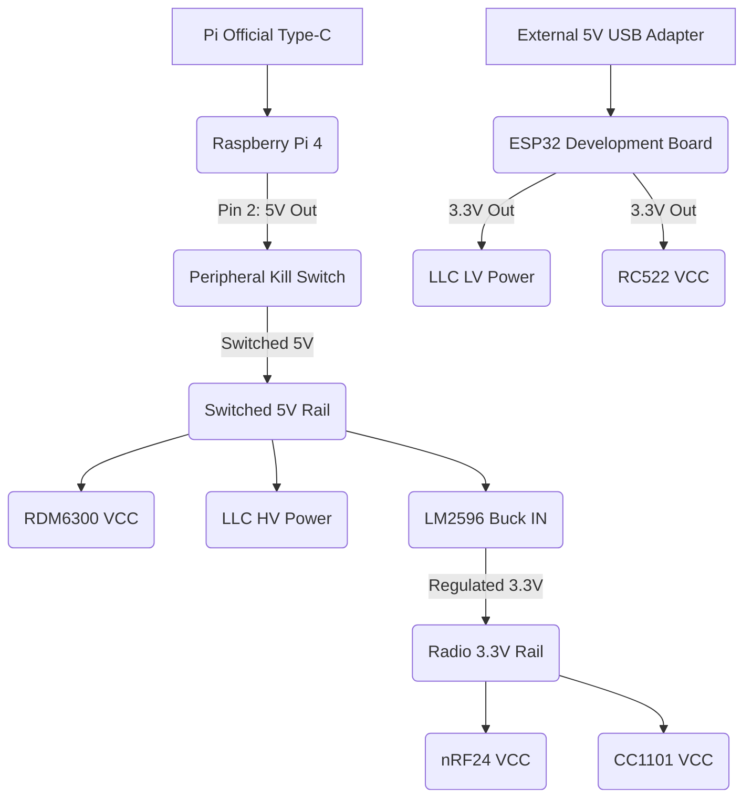
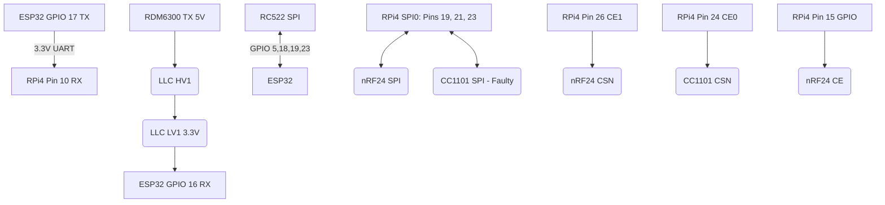
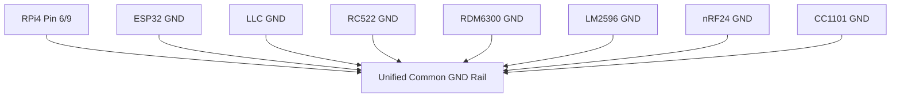

# ProxNet Wiring Diagram

This document details the hardware connections between the Raspberry Pi 4, ESP32, radio modules, and peripherals.

**⚠️ Critical Hardware Safety Notes:**
* **Common Ground:** ALL `GND` pins must tie to a single common ground rail. Without this, logic signals will float.
* **Power Isolation (Anti-Backfeeding):** The ESP32 is powered **externally** via USB. Do **NOT** route 5V from the Pi to the ESP32's 5V/VIN pin.
* **Kill Switch Routing:** The switch cuts the 5V line going to the **LM2596 buck converter** and **RDM6300**. It does **NOT** cut main power to the Pi.
* **Logic Level Converter (LLC):** Mandatory for dropping the 5V RDM6300 TX signal to 3.3V for the ESP32 RX pin.
* **Radio Power:** The nRF24L01+ and CC1101 are powered exclusively via the LM2596 tuned to **3.3V** (the Pi's 3V3 rail cannot supply enough peak current during TX).
* **Wi-Fi Adapter:** Connects directly to a Pi USB 2.0 port.

## 1. Power Distribution

## 2. Signal Routing

## 3. Common Ground Network

